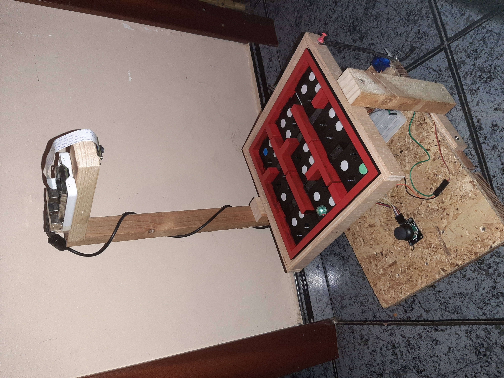
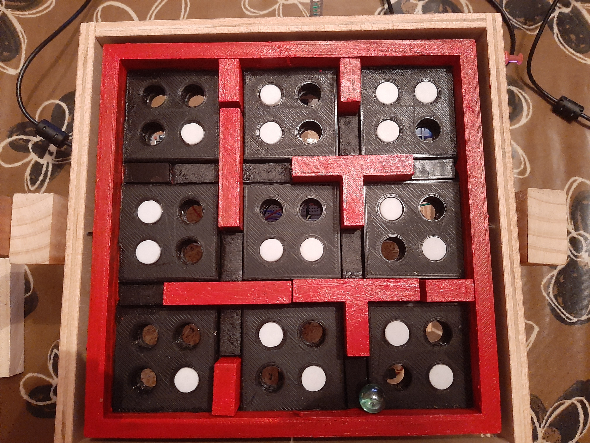
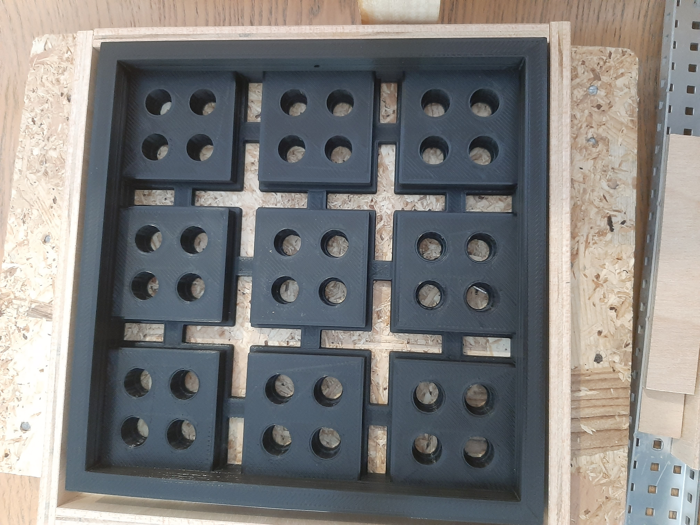
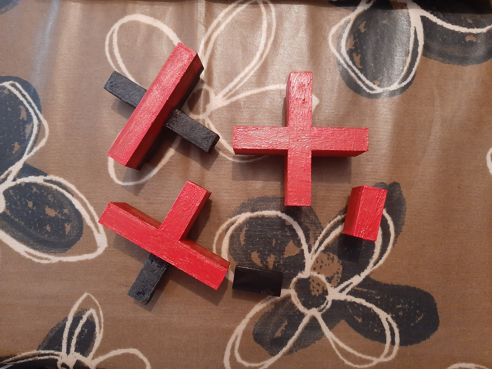
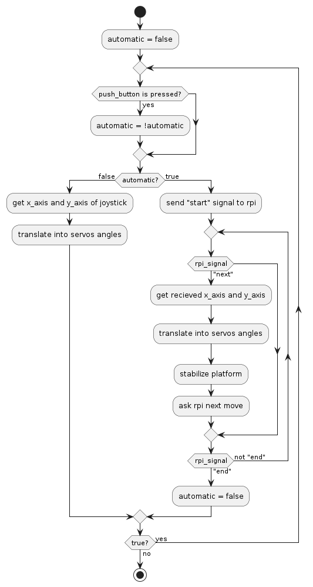
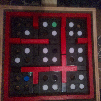
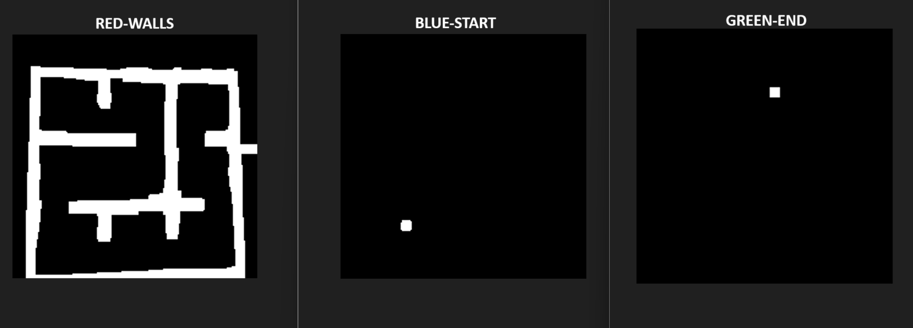
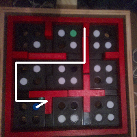
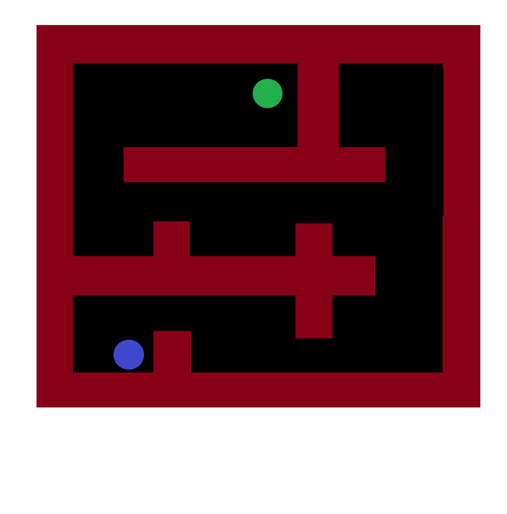

# TiltBot

## Index
- [Project description](#Project-description)
- [Structure](#Structure)
  - [Labyrinth platform](#Labyrinth-platform)
  - [Walls and plugs](#Walls-and-plugs)
- [Arquitecture](#Arquitecture)
  - [Action Module](#Action-Module)
    - [Action Hardware](#Action-Hardware)
    - [Action Software](#Action-Software)
  - [Vision Module](#Vision-Module)
    - [Vision Hardware](#Vision-Hardware)
    - [Vision Software](#Vision-Software)
    - [Limitations](#Vision-Limitations)
- [TO DOs](#TO-DOs)
- [References](#References)

## Project description
TiltBot is an entertainment device where you try to get a ball from one side of a maze to the opposite side, just by tilting it. Along the way, you'll need to dodge holes, or you'll have to start over!
Using it is simple: you can tilt the maze platform where the ball is located with a joystick.

If crossing the maze is too difficult, TiltBot has an extra feature. You can switch to an automatic mode, where AI will solve the maze, showing you one of the possible paths to the end. (For now, the algorithm is somewhat limited. See the Limitations section.)

Additionally, to increase the amount of fun, the maze format can be customized. You can open or close holes, as well as restructure the walls to choose your own difficulty.

## Structure
The structure is one of the most important parts of this project. To create a customizable maze, we had to come up with a structure that would allow us to rearrange where the walls that delimit the path of the maze should be, and the holes through which it should avoid falling. We designed the platform of our maze with holes where different pieces of walls fit and holes where plugs fit that allow the ball to pass over it. In addition to this, the structure has an exterior frame that will allow the platform to rotate on an axis. This has been achieved by means of a servomotor that will be attached to this frame by means of an elongated metal plate. As for the movement in the other axis of the inner platform, we have placed another servo attached to the bottom of the inner platform of the maze and joined to the outer frame by another plate. This allows us to obtain the desired movement in both axes.

#### Labyrinth platform

We made a platform that has nine main isles of floor. Among them, four central X-shaped holes remain in the center of the platform, and eight small holes are located on the exterior side. Also, each piece of the floor has four holes in it, that can be fitted with our plugs in order to make the maze either easier or harder.

#### Walls and plugs

We have designed different types of central walls, combining parts at ground level that let us create very varied mazes. For the exterior walls, we only have two types, ground level and wall lavel. Regarding the plugs, they are all the same, and they are of such a height that allows the ball to pass over it effortlessly.

#### 

## Arquitecture
For the operation of TiltBot, we have divided its components into two interconnected modules.

### Action Module
This module is the one in charge of the actual movement of the labyrinth that allows the puzzle to be solved.

#### Action Hardware
In order to move the structure, we make use of two different servo motors, one for the outer layer, and the other for the inner layer. Each of this servos move in different directions, allowing the structure to tilt in any angle needed. For a deeper understanding check [Structure](#Structure).

To be able to control manually this servos we have also connected a joystick, which moves both motors acordingly to the direction and amount of preassure applied on it.

All of this is interconected by an Arduino UNO R3 module.

#### Action Software
To make the servo motors move, we have implemented some simple code in the Arduino.
This require the following libraries:
- Servo.h
- Keyboard.h
- ArduinoJson.h

The code workflow is:

### Vision Module
The vision module is responsible for the automated maze-solving part. When requested, it will take a photograph of the maze from above and find a path from a starting point to an endpoint. It will then give instructions to the action module to try to move the ball along the path.

#### Vision Hardware
The hardware part is very simple. It consists of a Raspberry Pi 3B+ connected to a camera positioned above the center of the maze, and also connected to an Arduino UNO R3.

#### Vision Software
The software part is more complex.

*Dependencies*

To work with images, we use the OpenCV library and Numpy to handle the structures. 
Then, for the connection between the Raspberry Pi and the Arduino, we use the serial library along with the json library for sending information.

*Installation*

- pip install opencv
- pip install numpy
- pip install pyserial
- pip install json

The code waits for a start signal from the Arduino to begin the resolution algorithm. When it receives the signal, it takes a photograph of the maze, detects the walls, the starting point, and the ending point, and searches for a possible path that follows the walls.

initial labyrinth photo

labyrinth separated by colors

final labyrinth path

This path is calculated considering that when the maze is tilted, the ball will move to the nearest wall in that direction.

#### Vision Limitations
The pathfinding algorithm uses the walls to move the ball to the end. For this reason, there are some maze layouts that it is unable to solve, which are those where there is no way to access the final area through the walls. An example it cannot solve is the following.

The rest of the cases work correctly, at least on perfect images.

However, when applying the algorithm to real images, it does not work in 100% of the cases. Through testing, we have concluded that this is due to, among other things, imperfections in the materials/structure.

## TO DOs
- [x] Design and assembly of the structure.
- [x] Calibrate the movement ranges of the platform's servomotors.
  - [x] In the code.
  - [x] Phisically.
- [x] Vision Module.
  - [x] Differentiate obstacles, ball, and maze path using a camera.
  - [x] Basic algorithm to solve the maze.
  - [x] Improve the solving algorithm.
  - [x] Calibrate commands to move the ball in the correct direction.
- [x] Communication between the vision module and the action module.

## References
- Original idea for the project by Antonio Álvarez: https://www.youtube.com/watch?v=PMSr5L0SD24
- Tutorial - Usage of Joysticks with Arduino: https://programarfacil.com/blog/arduino-blog/joystick-con-arduino/
- Tutorial - Usage of Servos with Arduino: https://programarfacil.com/blog/arduino-blog/servomotor-con-arduino/
- Tutorial - Send data from Arduino to Raspberry (Serial connection): https://www.youtube.com/watch?v=-3swby4ryU4
